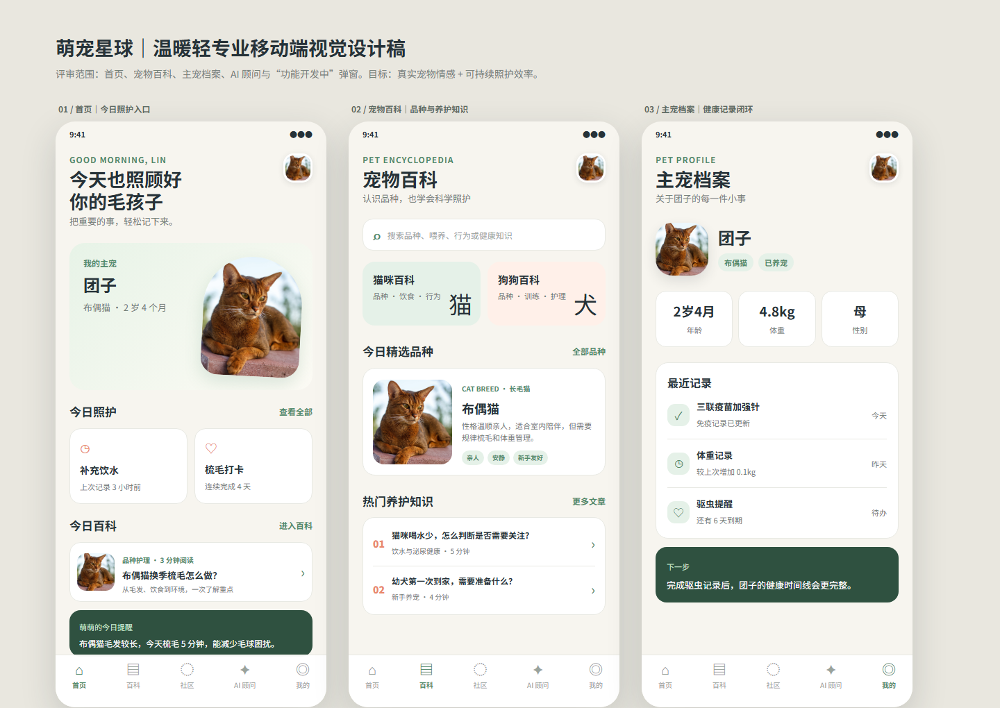

# 萌宠星球 Pet Planet

面向真实养宠用户的移动端社区与照护工具。项目围绕「认识宠物、建立主宠档案、记录日常、交流经验、获得 AI 辅助建议」构建，并为积分兑换和未来实物商城保留清晰的业务边界。

> 当前版本是可本地运行和验证的产品候选版。真实支付、生产邮件投递和公网部署尚未接入，相关入口会明确显示为“开发中”。



## 产品能力

| 模块 | 当前状态 | 说明 |
| --- | --- | --- |
| 首页 | 可用 | 用户分层入口、品种推荐、今日知识、主宠状态 |
| 宠物百科 | 可用 | 猫狗品种浏览、搜索、筛选与详情 |
| 主宠档案 | 可用 | 创建、编辑、删除当前用户的真实宠物档案 |
| 宠物社区 | 可用 | 动态、评论、点赞、收藏、圈子和通知闭环 |
| AI 顾问 | 可用但依赖配置 | 对接 DeepSeek；未配置或上游不可用时展示明确状态 |
| 积分兑换 | 可用 | 签到、积分流水和虚拟权益兑换 |
| 实物商城 | 开发中 | 仅保留入口与设计，不开放真实下单和支付 |
| 邮箱认证 | 接口可用但依赖配置 | 支持验证、验证码登录和重置流程；真实投递需要邮件服务 |

主导航按照高频用户任务排列为：`首页 -> 百科 -> 社区 -> AI 顾问 -> 我的`。社区发布仍然保留，通过社区页面内的发布入口进入。

## 设计方向

- 暖白背景、植物绿主色与珊瑚色提醒，降低长期使用时的视觉压力。
- 首页优先展示真实品种图片、百科和养宠任务，不使用营销式落地页结构。
- 百科、社区、主宠和 AI 保持独立职责，避免内容与交易状态相互污染。
- 未完成能力使用统一弹窗提示，不伪造成功状态或不可兑现的购买承诺。

完整设计与边界资料：

- [移动端 11 屏设计稿](docs/design-draft/pet-planet-mobile-design.html)
- [商城与支付模块边界](docs/superpowers/specs/2026-08-29-commerce-module-boundaries.md)
- [发布候选检查清单](docs/release/2026-08-25-candidate-freeze.md)

## 技术架构

- 客户端：Expo 56、React Native 0.85、React 19、Expo Router、TypeScript
- Web：React Native Web，支持 Expo Web 构建
- 服务端：Node.js、Express 5
- 数据库：MySQL
- 鉴权：JWT Access Token + Refresh Token
- AI：DeepSeek Chat API
- 文件上传：服务端本地存储适配层

主要目录：

```text
app/                    Expo Router 页面与导航
src/components/         通用 UI 组件
src/contexts/           登录、主宠等客户端状态
src/services/           API 与领域服务
server/routes/          Express API 路由
server/services/        邮件、上传等基础服务
server/migrations/      旧数据库增量迁移
docs/design-draft/      产品设计稿与预览图
docs/superpowers/       已确认的设计、计划与边界
scripts/                契约、迁移、烟测与发布验证
```

## 本地运行

### 1. 安装依赖

```powershell
npm install
npm --prefix server install
```

当前版本已在 Windows、Node.js `v26.7.0`、npm `11.19.0` 和 MySQL `9.7.0` 环境完成验证。其他受 Expo 56 和依赖支持的 Node.js / MySQL 版本也可使用，但应重新执行完整验证。

### 2. 配置服务端

复制示例配置并按本机环境填写：

```powershell
Copy-Item server/.env.example server/.env
```

本地开发至少需要可连接的 MySQL 配置。生产模式还必须设置：

```text
JWT_SECRET
JWT_REFRESH_SECRET
DB_PASSWORD
CORS_ORIGIN
UPLOAD_DIR
```

可选外部能力：

- 设置 `DEEPSEEK_API_KEY` 后启用真实 AI 回复。
- 设置 `EMAIL_PROVIDER`、`EMAIL_FROM` 及对应 Provider 参数后启用真实邮件投递。
- 前端开发环境默认请求 `http://localhost:3000/api`；需要修改时设置 `EXPO_PUBLIC_API_BASE_URL`。

不要提交 `server/.env`、API Key、JWT Secret 或数据库密码。

### 3. 初始化数据库

全新数据库使用完整 Schema：

```powershell
mysql -u root -p < server/full_schema.sql
node server/seed.js
```

已有旧数据库必须先备份，再按 [迁移说明](server/migrations/README.md) 执行 `002` 到 `010` 的增量迁移。不要在同一个数据库上混用完整 Schema 和旧库迁移路径。

### 4. 启动前后端

打开两个终端：

```powershell
npm run server
```

```powershell
npm run web
```

默认地址：

- Web：`http://localhost:8081`
- API：`http://localhost:3000/api`

移动端也可以使用：

```powershell
npm run android
npm run ios
```

## 验证

提交前推荐运行完整发布验证：

```powershell
npm run verify:pre-release
```

该命令依次验证：

- TypeScript 类型检查
- 单元测试
- 敏感配置扫描
- 数据库迁移契约与真实迁移
- 数据库状态摘要
- 服务端 API 冒烟测试
- Expo Web 构建
- 注册、主宠、发帖、评论、圈子和通知 UI 闭环
- UI 测试数据清理
- Git 空白检查

常用单项命令：

```powershell
npm run typecheck
npm run test:unit
npm run test:migrations
npm run test:server:smoke
npm run test:ui:smoke
npm run test:secrets
npm run build:web
node scripts/mobile-design-contract.test.js
node scripts/points-shop-contract.test.js
node scripts/product-experience-contract.test.js
```

## 商城与支付边界

积分兑换和真实货币商城是两条独立业务轨道：

- 积分只用于虚拟用品、主题和展示权益，不代表现金价值。
- 未来实物商城必须由服务端计算价格、优惠、运费和库存。
- 客户端不能判断支付成功，也不能直接推进订单或退款状态。
- 支付渠道需要通过独立适配层接入，并对回调、退款和重复提交做验签与幂等处理。
- 在订单、库存、支付和退款服务接通前，实物购买入口保持“开发中”。

## 当前限制

- 尚未接入真实支付沙箱或生产支付渠道。
- 邮件验证流程已实现，但生产邮件到达率未验证。
- AI 回复质量和可用性依赖 DeepSeek 配置与上游服务。
- 本地设计稿是当前 UI 评审依据；Figma 远端最终同步曾受 Starter MCP 调用额度限制。
- 公网域名、HTTPS、对象存储、监控和正式发布环境不包含在本仓库验证范围内。

## 安全与数据

- 生产环境启动时会校验关键配置，缺失时拒绝启动。
- 上传服务限制文件类型、大小和落盘路径。
- 敏感信息扫描只覆盖 Git 跟踪文件，提交前仍应人工确认暂存区。
- UI 冒烟测试会创建临时数据，并在结束后调用清理脚本；可使用 `npm run db:cleanup:dry-run` 检查残留。
